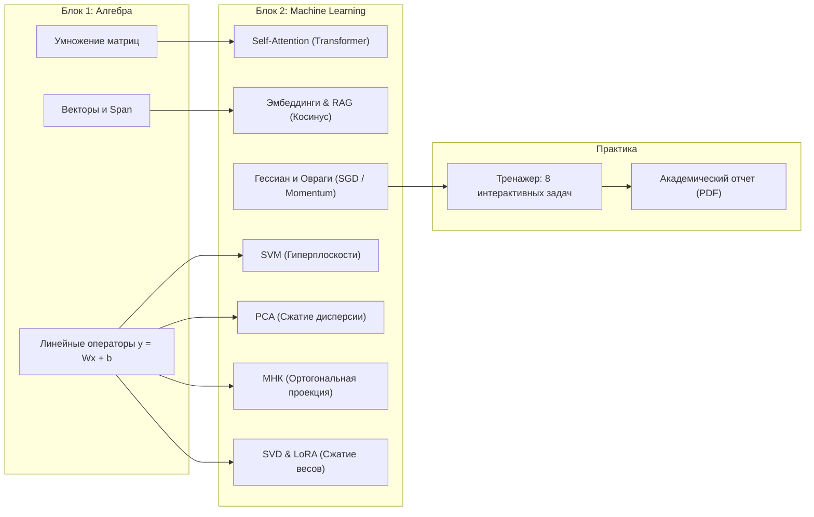

# MATHENGINE // LA_ML: Интерактивная линейная алгебра в машинном обучении

<div align="center">


**Визуальный интерактивный движок для глубокого освоения линейной алгебры в задачах Data Science, Deep Learning и LLM.**

[🚀 Быстрый старт](#-быстрый-старт) • [📚 Модули](#-структура-и-возможности-модулей) • [🎯 Тренажер (8 задач)](#-интерактивный-тренажер-практики) • [🔌 REST API](#-спецификация-rest-api) • [📖 Методическое пособие](#-методическое-пособие-и-источники)

</div>

---

## 💡 О проекте и педагогической концепции

Комплекс **LA_ML (Linear Algebra in Machine Learning)** разработан для преодоления классического разрыва между абстрактным университетским курсом линейной алгебры и ее практическим применением в современных алгоритмах искусственного интеллекта.

В основу положена парадигма **«Математика, которую видно» (Explorable Explanations)**:
- **Никаких сухих матриц без геометрии**: матрица — это непрерывная деформация пространства; определитель — изменение ориентированной площади; собственные векторы — инвариантные направления; скалярное произведение — мера семантической близости.
- **Прямой мост к современному AI**: каждый математический концепт мгновенно сопоставляется с архитектурным блоком реальной нейросети (полносвязные слои, механизм внимания в Transformer, адаптация низкого ранга LoRA, семантический поиск RAG, ландшафты потерь в оврагах).
- **Интерактивность 60 FPS**: расчет спектральных характеристик и деформация сетки происходят на лету при перетаскивании векторов и слайдеров курсором мыши.

---

## 🚀 Быстрый старт

### Способ 1: Запуск в среде JetBrains PyCharm (Основной)
1. Откройте **PyCharm** и перейдите в **File → Open...** → выберите папку проекта `LA_ML`.
2. Убедитесь, что настроен виртуальный интерпретатор Python 3.10+ (*Settings → Project: LA_ML → Python Interpreter*). Зависимости (`fastapi`, `uvicorn`, `numpy`) уже присутствуют в среде.
3. В правом верхнем углу окна выберите готовую конфигурацию запуска **"Run LA_ML"** и нажмите зеленую кнопку **▶ Run** (или нажмите правой кнопкой мыши по файлу `main.py` → **Run 'main'**).
4. Сервер автоматически запустится и откроет интерактивное приложение в браузере: **[http://127.0.0.1:8000](http://127.0.0.1:8000)**.

### Способ 2: Запуск одним кликом в Windows
- Дважды кликните по файлу **`run.bat`** в проводнике Windows. Скрипт активирует окружение и запустит веб-интерфейс.

### Способ 3: Запуск через консоль PowerShell / CMD
```powershell
# Активация виртуального окружения
.\.venv\Scripts\activate

# Запуск веб-сервера
python main.py
```

---

## 📂 Структура проекта

```
LA_ML/
├── main.py                     # Маршрутизатор FastAPI и локальный сервер
├── run.bat                     # Скрипт быстрого запуска под Windows
├── requirements.txt            # Список зависимостей Python
├── STUDY_GUIDE_LA_ML.md        # Полное академическое методическое пособие
├── README.md                   # Руководство пользователя и документация
├── app/
│   ├── math_core.py            # Математическое ядро (NumPy: SVD, PCA, OLS, Attention, Hessian)
│   ├── challenges.py           # Генератор практических задач и модуль автопроверки
│   └── static/                 # Клиентское Single Page Application (SPA)
│       ├── index.html          # Разметка вкладок, KaTeX-формулы, панели управления
│       ├── css/style.css       # Дизайн-системы: Нео-брутализм и Retro Studio (Dark/Light)
│       └── js/
│           ├── canvas.js       # Движок 2D-векторной графики и деформаций на Canvas
│           ├── modules.js      # Контроллеры модулей (1–4, MatMul, Vectors)
│           ├── new_modules.js  # Контроллеры ML-модулей (SVM, Attention, Hessian)
│           └── app.js          # Инициализация SPA, навигация, экспорт PDF-отчета
└── tests/
    └── test_math_core.py       # Комплекс автоматических unit-тестов математического ядра
```

---

## 📚 Структура и возможности модулей

Комплекс разделен на два взаимосвязанных смысловых блока: **Фундаментальная алгебра** и **Прикладной Machine Learning**.



---

### БЛОК 1. ФУНДАМЕНТАЛЬНАЯ ЛИНЕЙНАЯ АЛГЕБРА

#### 1. 🔢 Умножение матриц ($A \times B = C$) (`tab-matmul`)
- **Пошаговая анимация**: синхронная подсветка активной строки матрицы $A$ (синяя) и столбца матрицы $B$ (персиковая).
- **Арифметическая детализация**: развернутый показ скалярного произведения в ячейке $c_{ij}$: $(a_{i1} b_{1j}) + (a_{i2} b_{2j}) + \dots = c_{ij}$.
- **Гибкость размерностей**: выбор пресетов $2\times2 \times 2\times2$, $2\times3 \times 3\times2$, $3\times3 \times 3\times3$ и матрично-векторного умножения $2\times2 \times 2\times1$, а также режим ввода произвольных чисел.
- **Связь с ML**: базовая операция полносвязных слоев ($z = Wx + b$) и алгоритм GEMM на тензорных ядрах GPU.

#### 2. ↗️ Геометрия векторов и линейная оболочка (`tab-vectors`)
- **Интерактивные векторы**: перемещение наконечников векторов $\mathbf{u}$ и $\mathbf{v}$ курсором мыши.
- **Линейная комбинация и Span**: слайдеры коэффициентов $c_1 \mathbf{u} + c_2 \mathbf{v}$ с визуализацией координатной сетки линейной оболочки.
- **Скалярное произведение и проекция**: расчет длины проекции $\operatorname{proj}_{\mathbf{v}}\mathbf{u}$, угла $\theta$ и ориентированной площади параллелограмма $\mathbf{u} \wedge \mathbf{v}$.
- **Связь с ML**: пространства признаков (Feature Spaces), косинусная нормализация и ортогональная инициализация весовых матриц.

#### 3. 🔄 Линейные трансформации и нейросети ($y = Wx + b$) (`tab-module1`)
- **Деформация пространства**: координатная сетка искажается в реальном времени при изменении коэффициентов матрицы $W$.
- **Манипуляция базисом**: перетаскивание кончиков базисных осей $\hat{\mathbf{i}}'$ и $\hat{\mathbf{j}}'$ прямо на холсте.
- **Геометрия определителя $\det(W)$**: наглядная демонстрация масштабирования площади, зеркального выворачивания ($\det < 0$) и коллапса пространства в прямую ($\det = 0$).
- **Собственные векторы ($W\mathbf{v} = \lambda\mathbf{v}$)**: автоматическая отрисовка инвариантных прямых и расчет собственных чисел.
- **Режим Dense-слоя**: деформация двух классов точек и применение нелинейных функций активации ($\operatorname{ReLU}$, $\operatorname{Sigmoid}$, $\operatorname{Tanh}$).
- **Связь с ML**: демонстрация того, почему сеть без активаций схлопывается в одну матрицу, и как нелинейности распрямляют многообразия.

---

### БЛОК 2. ПРИКЛАДНОЙ MACHINE LEARNING & DEEP LEARNING

#### 4. ⚔️ Линейная классификация и Метод опорных векторов (SVM) (`tab-svm`)
- **Разделяющая гиперплоскость $\mathbf{w}^T \mathbf{x} + b = 0$**: управление нормалью $\mathbf{w}$ и сдвигом $b$.
- **Полоса отступа (Margin)**: отрисовка канонических границ $\mathbf{w}^T \mathbf{x} + b = \pm 1$ с шириной $2\gamma = \frac{2}{\|\mathbf{w}\|}$.
- **Опорные векторы**: автоматическое детектирование критических точек выборки и расчет функции потерь Hinge Loss.
- **Датасет Ирисов Фишера**: встроенный пресет реальных данных (Setosa vs Versicolor) для оценки Accuracy в реальном времени.
- **Связь с ML**: принцип максимального отступа (Max-Margin) и связь $L_2$-регуляризации с максимизацией зазора.

#### 5. 🧠 Механизм внимания (Self-Attention) в трансформерах (`tab-attention`)
- **Матричный конвейер**: пошаговый расчет формулы:
  $$\operatorname{Attention}(Q, K, V) = \operatorname{softmax}\left(\frac{Q K^T}{\sqrt{d_k}}\right) V$$
- **Интерактивная фраза**: *«Кот сидит на ковре»* (4 токена).
- **Матрицы в реальном времени**: отображение $Q, K, K^T, S = QK^T$, масштабного коэффициента $\frac{1}{\sqrt{d_k}}$, карты внимания $A$ и контекстных эмбеддингов $O$.
- **2D-векторная полярная плоскость**: проекция векторов запросов и ключей с отображением взаимных углов сходства.
- **Связь с ML**: фундаментальный строительный блок всех современных больших языковых моделей (LLM: GPT-4, Claude 3.5, Gemini 1.5, LLaMA 3).

#### 6. 📉 Обусловленность Гессиана и овраги функции потерь (`tab-hessian`)
- **Матрица вторых производных $H = \nabla^2 \mathcal{L}$**: управление собственными числами $\lambda_{\max}, \lambda_{\min}$ и углом поворота оврага $\theta$.
- **Число обусловленности $\kappa = \frac{\lambda_{\max}}{\lambda_{\min}}$**: формирование глубоких и узких каньонов функции потерь.
- **Порог устойчивости**: детектор критического шага $\eta_{\text{crit}} = \frac{2}{\lambda_{\max}}$, при котором градиентный спуск экспоненциально взрывается.
- **Сравнение SGD vs Momentum**: одновременная симуляция траекторий классического стохастического градиентного спуска (хаотичные осцилляции поперек оврага) и метода тяжелого шарика Поляка (плавное скольжение по дну).
- **Связь с ML**: физическое объяснение эффективности современных оптимизаторов (AdamW, RMSProp).

#### 7. 📊 Метод главных компонент (PCA) (`tab-module2`)
- **Интерактивная выборка**: добавление точек кликом мыши или генерация статистических распределений.
- **Ковариационная матрица $\Sigma$**: расчет в реальном времени и нахождение спектрального базиса.
- **Оси максимальной дисперсии**: отображение эллипса рассеяния данных ($1\sigma, 2\sigma$) вдоль главных осей $\mathbf{v}_1, \mathbf{v}_2$.
- **Плавный слайдер сжатия 2D $\to$ 1D**: анимация ортогональной проекции с выводом доли объясненной дисперсии (EVR) и ошибки реконструкции (MSE).
- **3D-режим**: вращение трехмерного облака точек с проекцией на главную плоскость.
- **Связь с ML**: редукция размерности данных, устранение мультиколлинеарности и линейные автоэнкодеры.

#### 8. 📐 Метод наименьших квадратов (МНК) и ортогональная проекция (`tab-module3`)
- **Линейная регрессия**: перетаскивание точек данных с мгновенным пересчетом модели $y = wx + b$.
- **Геометрическое условие ортогональности**: отображение вертикальных отрезков невязок $\mathbf{e} = \mathbf{y} - \hat{\mathbf{y}}$ и численное подтверждение $X^T \mathbf{e} \approx 0$.
- **Сравнение алгоритмов**: аналитическое решение через нормальное уравнение $\mathbf{w} = (X^T X)^{-1} X^T \mathbf{y}$ vs итеративный градиентный спуск (GD).
- **Метрики качества**: расчет коэффициента детерминации $R^2$ и среднеквадратичной ошибки MSE.
- **Связь с ML**: классическая регрессия, псевдообратные матрицы Мура — Пенроуза и регуляризация Тихонова (Ridge).

#### 9. 🧬 Сингулярное разложение (SVD) и адаптация LoRA (`tab-svd`)
- **4-этапный непрерывный скраббинг деформации**:
  $$x \xrightarrow{\text{Поворот } V^T} V^T x \xrightarrow{\text{Масштаб } \Sigma} \Sigma V^T x \xrightarrow{\text{Поворот } U} U \Sigma V^T x$$
- **Низкоранговая аппроксимация (Теорема Эккарта — Янга)**: сжатие матрицы $6 \times 6$ с выбором ранга $k \in [1, 4]$ и показом слагаемых ранга 1 ($\sigma_i \mathbf{u}_i \mathbf{v}_i^T$).
- **Кривая энергии**: спектральный график сингулярных чисел с горизонтальным порогом сохранения $\ge 90\%$ энергии.
- **Сравнение параметров (LoRA)**: сопоставление исходной памяти $m \times n$ и факторизованного представления $k(m + n)$.
- **Связь с ML**: метод Parameter-Efficient Fine-Tuning (PEFT/LoRA) для дообучения моделей с десятками миллиардов параметров.

#### 10. 🔍 Векторные эмбеддинги и Косинусное сходство (RAG) (`tab-embeddings`)
- **Семантический поиск Top-$K$**: интерактивный вектор запроса $\mathbf{q}$ на единичной сфере, расчет косинусного сходства $\cos\theta = \frac{\mathbf{u} \cdot \mathbf{v}}{\|\mathbf{u}\| \|\mathbf{v}\|}$, углов и ранжирование базы знаний.
- **Инвариантность к масштабу**: наглядное объяснение преимуществ косинусной меры перед евклидовым расстоянием при анализе текстов разной длины.
- **Векторная арифметика Word2Vec**: геометрическая демонстрация соотношения «Король − Мужчина + Женщина = Королева».
- **Связь с ML**: Retrieval-Augmented Generation (RAG) и векторные базы данных (FAISS, Milvus, Chroma, Qdrant).

---

## 🎯 Интерактивный тренажер практики

Вкладка **«ТРЕНАЖЕР»** (`tab-module4`) содержит 8 расчетно-графических задач с автоматической генерацией условий и верификацией:

| № | Название задачи | Математическая суть | Критерий успешной проверки |
|:---:|---|---|---|
| **1** | **Векторный таргетинг** | Линейное отображение $W\mathbf{u} = \mathbf{v}$ | Погрешность длины вектора $\|W\mathbf{u} - \mathbf{v}\| < 0.15$ |
| **2** | **Обращение деформации** | Поиск обратной матрицы $W^{-1}$ | Норма ошибки Фробениуса $\|W_{user} W - I\|_F < 0.20$ |
| **3** | **Охота за главной осью (PCA)** | Поиск собственного вектора ковариации | Отклонение угла оси $\le 12^\circ$ от истинной $v_1$ |
| **4** | **Энергия сингулярного разложения** | Теорема Эккарта — Янга | Нахождение минимального ранга $k$, дающего $E(k) \ge 90\%$ |
| **5** | **Векторный таргетинг RAG** | Косинусное сходство на единичной сфере | Достижение косинуса $\operatorname{CosSim}(\mathbf{q}, \mathbf{d}) \ge 0.95$ |
| **6** | **Разделение классов (SVM)** | Настройка разделяющей гиперплоскости | Достижение 100% точности классификации (Accuracy = 1.0) |
| **7** | **Инвариантное направление** | Собственный вектор оператора $W\mathbf{v} = \lambda\mathbf{v}$ | Ошибка коллинеарности $\sin\phi < 0.08$ |
| **8** | **Проекция МНК на глаз** | Минимизация нормы вектора остатков | Достижение нормы $\|\mathbf{e}\| \le 1.25 \|\mathbf{e}_{OLS}\|$ |

### Академический отчет (PDF)
По нажатию кнопки **«📑 Сформировать отчет (PDF)»** в шапке формируется чистый документ с результатами решенных задач, набранными баллами и текущими параметрами системы, готовый к печати или сдаче преподавателю.

---

## 🔌 Спецификация REST API

Бэкенд на FastAPI предоставляет строго типизированные эндпоинты (валидация через Pydantic):

| Метод | Эндпоинт | Описание |
|---|---|---|
| `POST` | `/api/transform` | Расчет определителя, ранга, спектра, обратной матрицы и деформации квадрата |
| `POST` | `/api/pca` | Ковариационная матрица, главные компоненты, дисперсия EVR, проекции и MSE |
| `POST` | `/api/least-squares` | Аналитический МНК, псевдообратная матрица, проектор $P$, невязки $e$ и $R^2$ |
| `POST` | `/api/neural-layer` | Деформация Dense-слоя с нелинейными активациями (ReLU, Sigmoid, Tanh) |
| `POST` | `/api/svd` | Сингулярное разложение $A = U\Sigma V^T$ и координаты 4 стадий деформации |
| `POST` | `/api/low-rank` | Усеченное разложение Эккарта — Янга, кумулятивная энергия и LoRA-сжатие |
| `POST` | `/api/embeddings/similarity` | Косинусное сходство, углы в градусах и извлечение Top-$K$ документов RAG |
| `POST` | `/api/embeddings/analogy` | Векторная аналогия $A - B + C$ с поиском ближайшего соседа по словарю |
| `POST` | `/api/svm` | Оценка разделяющей гиперплоскости, ширина отступа, опорные векторы и Hinge Loss |
| `POST` | `/api/attention` | Матричный конвейер Self-Attention ($Q, K, V, S, A, O$), масштабирование и проекции |
| `POST` | `/api/hessian-landscape` | Число обусловленности Гессиана $\kappa$, шаг $\eta_{\text{crit}}$, симуляция SGD vs Momentum |
| `GET` | `/api/challenges/list` | Получение списка доступных практических заданий |
| `GET` | `/api/challenges/generate/{id}` | Генерация случайного экземпляра задачи с эталонным решением |
| `POST` | `/api/challenges/verify/{id}` | Верификация студенческого ответа с выдачей баллов и подсказок |

---

## 🧪 Тестирование и верификация

Математическое ядро покрыто набором автоматических тестов (`unittest`), верифицирующих алгоритмы трансформаций, спектрального разложения, ортогональности проекций, стабильности LoRA и генераторов задач.

```powershell
# Запуск тестов из корня проекта:
.\.venv\Scripts\python.exe -m unittest discover -s tests -p "test_*.py" -v
```

Результат выполнения:
```
test_challenges (test_math_core.TestMathCore.test_challenges) ... ok
test_embeddings_similarity (test_math_core.TestMathCore.test_embeddings_similarity) ... ok
test_hessian_landscape (test_math_core.TestMathCore.test_hessian_landscape) ... ok
test_identity_transform (test_math_core.TestMathCore.test_identity_transform) ... ok
test_least_squares (test_math_core.TestMathCore.test_least_squares) ... ok
test_low_rank_approx (test_math_core.TestMathCore.test_low_rank_approx) ... ok
test_neural_layer (test_math_core.TestMathCore.test_neural_layer) ... ok
test_new_challenges (test_math_core.TestMathCore.test_new_challenges) ... ok
test_pca_basic (test_math_core.TestMathCore.test_pca_basic) ... ok
test_rotation_transform (test_math_core.TestMathCore.test_rotation_transform) ... ok
test_self_attention (test_math_core.TestMathCore.test_self_attention) ... ok
test_singular_transform (test_math_core.TestMathCore.test_singular_transform) ... ok
test_svd (test_math_core.TestMathCore.test_svd) ... ok
test_svm_classification (test_math_core.TestMathCore.test_svm_classification) ... ok
test_vector_analogy (test_math_core.TestMathCore.test_vector_analogy) ... ok

----------------------------------------------------------------------
Ran 15 tests in 0.171s
OK
```

---

## 📖 Методическое пособие и источники

В репозиторий включено подробное академическое руководство: **[`STUDY_GUIDE_LA_ML.md`](STUDY_GUIDE_LA_ML.md)**.

### Рекомендуемая фундаментальная литература
1. **Gilbert Strang** — *«Linear Algebra and Learning from Data»* (Wellesley-Cambridge Press, 2019). Главный мировой учебник по взаимосвязи линейной алгебры и глубоких нейросетей.
2. **Marc Peter Deisenroth et al.** — *«Mathematics for Machine Learning»* (Cambridge University Press, 2020). [Онлайн-версия](https://mml-book.github.io).
3. **Ian Goodfellow et al.** — *«Deep Learning»* (MIT Press, 2016; Глава 2 «Linear Algebra»).
4. **Stephen Boyd, Lieven Vandenberghe** — *«Introduction to Applied Linear Algebra – Vectors, Matrices, and Least Squares»* (2018). [Онлайн-версия](https://web.stanford.edu/~boyd/vmls/).

### Интерактивные ресурсы и медиатека
- **3Blue1Brown**: видеокурс [«Суть линейной алгебры»](https://www.youtube.com/playlist?list=PLZHQObOWTQDPD3MizzM2xVFitgF8hE_ab) (Grant Sanderson).
- **Distill.pub**: интерактивная статья Габриэля Гоха [«Why Momentum Really Works»](https://distill.pub/2017/momentum/).
- **Jay Alammar**: визуальные руководства [«The Illustrated Transformer»](https://jalammar.github.io/illustrated-transformer/) и [«The Illustrated Word2Vec»](https://jalammar.github.io/illustrated-word2vec/).
- **MIT OpenCourseWare**: курсы профессора Гилберта Стрэнга [MIT 18.06](https://ocw.mit.edu/courses/18-06-linear-algebra-spring-2010/) и [MIT 18.065](https://ocw.mit.edu/courses/18-065-matrix-methods-in-data-analysis-signal-processing-and-machine-learning-spring-2018/).

---

## 🛠 Технический стек и дизайн-системы

- **Backend**: Python 3.10+, FastAPI, Uvicorn, NumPy, Pydantic.
- **Frontend**: Чистый JavaScript (ES6+), HTML5 Canvas 2D Engine (аппаратное ускорение 60 FPS, адаптация под экраны Retina / HiDPI), библиотека KaTeX для рендеринга формул.
- **Дизайн**: 2 переключаемые темы оформления:
  1. *Нео-брутализм (Небо & Персик)* — контрастная геометрия и четкие границы.
  2. *Retro Studio (Матча & Клубника)* — мягкая студийная палитра.
  - Поддержка светлого (**Light**) и темного (**Dark**) режимов отображения.
